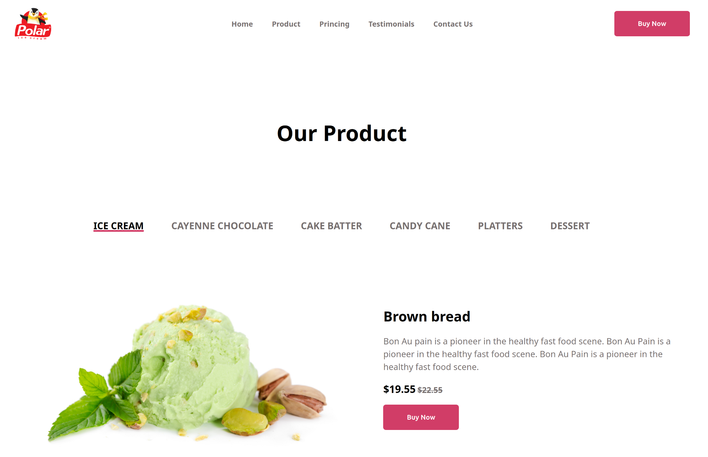

# Ice-cream 🍦

Welcome to the **Ice-cream** project! This project is a **_training exercise_** to improve my web development skills with **HTML** and **CSS**.

## Description

The "Ice-cream" project consisted in creating a simple and aesthetic user interface, presenting different ice creams to the user.

## Preview

Here's a screenshot of the project:

## Project objectives

 - **Learn and practice HTML** : Structure web pages.
 - **Master the basics of CSS** : Stylize HTML elements to create a visually appealing interface.
 - **Practice structuring a project** : Organize files and code for a clear, maintainable project.

## Technologies used

 - **HTML (61.2%)** : Used for page structure.
 - **CSS (38.8%)**: Used for formatting and aesthetics.

## How to use this project

 1. Download the repository to your computer.
    - **Download ZIP**
    - Extract the folder
 2. Open the **_index.html_** file with your browser.
